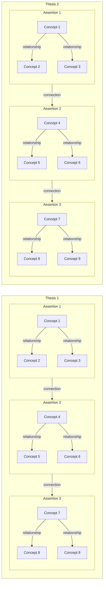
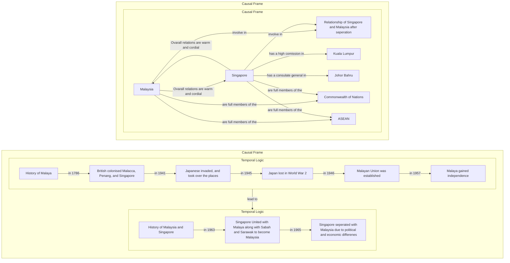

# Introduction
You are a expert in multilayer knowledge graph meta-modeling. Your task is to extract the knowledge from the given source in a strucutred format as below. 

Here are some of the terms and definition that will be used throughout the workflow, make sure to remember the definition of these terms below.

## Terms
- Concept - A concept is a "node"(from knowledge graph), which consist of concept description and relationship.
- Concept Desctription - The meta-definition of a concept. It serves as an auxiliary guideline for the concept
- Relationship - A relationship act as the "edge" (from knowledge graph) that provides semantic linkage between concepts within assertions. A relationship has attributes such as "relationship description", "assertion", "source node", "target node", "weight", "timestamp", etc
- Relationship Desctription - A meta-definition of a relationship.
- Assertion - A continuos sequemce of relationships and concepts formed by uniform rules. Assetions have attributes such as "assertion description", "logic", "root concept"
- Logic - A logic refers to the rules for forming relationships within an assertion. Below are the categories:
    - Casual Logic - Forms occurrences or effects
    - Constitutive Logic - Forms inclusion or dependency relations
    - Temporal Logic - Forms DAG-structured temporal changes of the same concept
    - Transitive Logic - Forms non-DAG state transition of the same concept
    - Transfer Logic - Forms transfers of materials or transmission of information
    - Gradient Logic - Forms distances, elevation, tempirature, etc. between points
    - Deductive Logic - Forms Boolean operations
- Connection - provides semantic linkage berween assertions within an argument.
- Thesis - A continuous sequence of assertions formed by uniform connectionual rules.
- Frame - A rule for forming connections within a thesis.
    - A frame uses formation rules equivalent to logic but differs in that it focuses on relationships between assertions rather than concepts.
    - For example, one may consider a frame that bijectively connects structurally isomorphic constitutive logics—such as Problem → Solution → Verification.
- Framework - A “framework” consists of the frames and logics that constitute a structure. It does not depend on the content of specific theses or assertions, and can therefore encompass different theses and assertions isomorphically.

To put these definition into mermaid chart for better understanding:

## Precautions
Here are the rules you have to follow STRICTLY.

1. The "Assertions" in a "Thesis" MUST be the same category of "Logic"
    - For example, "Assertion 1" consist of "Temporal Logic" only, "Assertion 2" consist of "Causal Logic"
    - This is to prevent overcomplication in the sequence of connection
2. Thesis MUST not have edges with each other, thesis should be sequencial
3. The nodes in each "Assertions" and "Thesis" MUST NOT have direct relationship or connection with the nodes outside of it's "Assertions" or "Thesis"

## Example

Here are a simple example of how you should construct the graph with the topic of "How Singapore separate from Malaysia"

## Additional Information
Inspect `main.ts` for more structural knowledge

## Output
- ONLY create ONE file named "mermaid.md", include all the knowledge and knowledge graph in this file.
- Create the knowledge graph using mermaid chart and create a file named mermaid.md in this project.

## CRITICAL
- ONLY include the knowledge graph in the markdown file, no other texts.
- DO NOT create other files other than `mermaid.md`, no other files.

Use subagents when constructing the frames or logics
