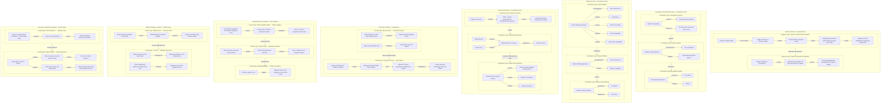

```mermaid
graph TB
%% Thesis 1: Historical Timeline (Temporal Frame)
subgraph T1["Historical Timeline - Temporal Frame"]
    direction TB

    %% Assertion 1: Taiwan's Political Control Timeline
    subgraph A1["Temporal Logic: Taiwan's Political Status Evolution"]
        TPS["Taiwan's Political Status"]
        CE["Under full control of Chinese empire"]
        JC["Taiwan became Japanese colony"]
        NG["Nationalist government under Chiang Kai-shek took control"]
        ROC["Republic of China established in Taiwan by fleeing KMT"]

        TPS --> |in 17th century| CE
        CE --> |in 1895| JC
        JC --> |in 1945| NG
        NG --> |in 1949| ROC
    end

    %% Assertion 2: International Diplomatic Status Timeline
    subgraph A2["Temporal Logic: Taiwan's Diplomatic Recognition"]
        TDR["Taiwan's Diplomatic Recognition"]
        IRC["International recognition of ROC government in Taiwan"]
        USR["US switched diplomatic recognition from Taipei to Beijing"]

        TDR --> |in 1949| IRC
        IRC --> |in 1979| USR
    end

    A1 --> |diplomatic consequence| A2
end

%% Thesis 2: Geographic and Political Structure (Constitutive Frame)
subgraph T2["Geographic and Political Structure - Constitutive Frame"]
    direction TB

    %% Assertion 3: Geographic Positioning
    subgraph A3["Constitutive Logic: Geographic Structure"]
        TGeo["Taiwan's Geography"]
        IC["First island chain position"]
        Dist["100 miles from south-east China coast"]

        TGeo --> |is-part-of| IC
        TGeo --> |consists-of| Dist
    end

    %% Assertion 4: Political System Structure
    subgraph A4["Constitutive Logic: Political System"]
        TPS2["Taiwan's Political System"]
        Const["Own constitution"]
        Demo["Democratically-elected leaders"]

        TPS2 --> |is-composed-of| Const
        TPS2 --> |includes| Demo
    end

    %% Assertion 5: International Recognition Structure
    subgraph A5["Constitutive Logic: Recognition System"]
        IntRec["International Recognition"]
        Twelve["12 countries"]
        Vat["Vatican"]

        IntRec --> |consists-of| Twelve
        IntRec --> |includes| Vat
    end

    A3 --> |supports| A4
    A4 --> |determines| A5
end

%% Thesis 3: Military Structure (Constitutive Frame)
subgraph T3["Military Structure - Constitutive Frame"]
    direction TB

    %% Assertion 6: China's Military Composition
    subgraph A6["Constitutive Logic: China's Military"]
        CMA["China's Military Apparatus"]
        CMF["2M+ armed forces"]
        Naval["Naval power"]
        Missile["Missile technology"]
        Aircraft["Aircraft capabilities"]
        Cyber["Cyber attack capabilities"]

        CMA --> |is-composed-of| CMF
        CMA --> |contains| Naval
        CMA --> |contains| Missile
        CMA --> |contains| Aircraft
        CMA --> |contains| Cyber
    end

    %% Assertion 7: Taiwan's Military Composition
    subgraph A7["Constitutive Logic: Taiwan's Military"]
        TMA["Taiwan's Military Apparatus"]
        TMF["170K armed forces"]
        Def["Defense capabilities"]

        TMA --> |is-composed-of| TMF
        TMA --> |includes| Def
    end

    %% Assertion 8: Defense Alliance Structure
    subgraph A8["Constitutive Logic: Defense Dependencies"]
        DefAll["Taiwan's Defense Alliance"]
        USSupp["US support"]
        Arms["Arms sales"]

        DefAll --> |depends-on| USSupp
        DefAll --> |depends-on| Arms
    end

    A6 --> |outmatches| A7
    A7 --> |requires| A8
end

%% Thesis 4: Economic Structure (Constitutive Frame)
subgraph T4["Economic Structure - Constitutive Frame"]
    direction TB

    %% Assertion 9: Taiwan's Economic Components
    subgraph A9["Constitutive Logic: Taiwan's Economy"]
        TEcon["Taiwan's Economy"]
        TSMC["TSMC - Taiwan Semiconductor Manufacturing Company"]
        SemiDom["Over half of world's semiconductor market"]

        TEcon --> |includes| TSMC
        TSMC --> |controls| SemiDom
    end

    %% Assertion 10: Global Economic Dependencies
    subgraph A10["Constitutive Logic: Global Dependencies"]
        GlobalEcon["Global Electronics Industry"]
        Phones["Mobile phones"]
        EVs["Electric cars"]
        Chips["Computer chips"]

        GlobalEcon --> |depends-on| Chips
        Phones --> |is-part-of| GlobalEcon
        EVs --> |is-part-of| GlobalEcon
    end

    %% Assertion 11: Cross-strait Trade Structure
    subgraph A11["Constitutive Logic: Taiwan-China Relations"]
        TradeSys["Taiwan-China Economic System"]
        BigTrade["China is Taiwan's biggest trading partner"]
        BizConn["Business connections"]
        FamConn["Family connections"]

        TradeSys --> |includes| BigTrade
        TradeSys --> |contains| BizConn
        TradeSys --> |contains| FamConn
    end

    A9 --> |powers| A10
    A10 --> |creates interdependence with| A11
end

%% Thesis 5: Historical Causation (Causal Frame)
subgraph T5["Historical Causation - Causal Frame"]
    direction TB

    %% Assertion 12: War Outcomes Causing Territorial Changes
    subgraph A12["Causal Logic: War Outcomes → Territorial Changes"]
        QE["Qing Empire loses First Sino-Japanese War"]
        JCol["Taiwan becomes Japanese colony"]
        WWII["Japan loses World War Two"]
        ChinaTake["China takes control of Taiwan"]

        QE --> |resulted in| JCol
        WWII --> |resulted in| ChinaTake
    end

    %% Assertion 13: Political Victory Leading to Government Formation
    subgraph A13["Causal Logic: Communist Victory → KMT Retreat"]
        CW["Communist Party wins Chinese Civil War"]
        KMTFlee["Chiang Kai-shek and KMT flee to Taiwan"]
        ROCEst["Republic of China government established in Taiwan"]
        Claim["China's historical sovereignty claim over Taiwan"]

        CW --> |caused| KMTFlee
        KMTFlee --> |led to| ROCEst
        ROCEst --> |contributes to| Claim
    end

    A12 --> |historical chain leads to| A13
end

%% Thesis 6: Diplomatic Power Causation (Causal Frame)
subgraph T6["Diplomatic Power Causation - Causal Frame"]
    direction TB

    %% Assertion 14: US Policy Shift and Consequences
    subgraph A14["Causal Logic: US Recognition Switch → Taiwan Isolation"]
        US1979["US switches recognition from Taipei to Beijing in 1979"]
        TurnPt["Turning point in Taiwan's international status"]
        Isolation["Only 12 countries recognize Taiwan today"]

        US1979 --> |caused| TurnPt
        TurnPt --> |resulted in| Isolation
    end

    %% Assertion 15: China's Economic Power and Diplomatic Pressure
    subgraph A15["Causal Logic: China's Power → Diplomatic Isolation"]
        ChinaPow["China becomes richer and more powerful"]
        Pressure["China exerts diplomatic pressure"]
        NoRecog["More countries do not recognize Taiwan"]

        ChinaPow --> |enables| Pressure
        Pressure --> |results in| NoRecog
    end

    %% Assertion 16: Deteriorating Relations
    subgraph A16["Causal Logic: Strained Relations → Policy Accusations"]
        Sour["US-China relations sour"]
        Accuse["Beijing accuses US of reneging on One-China policy"]

        Sour --> |triggers| Accuse
    end

    A14 --> |compounds with| A15
    A15 --> |intensifies into| A16
end

%% Thesis 7: Military Strategic Causation (Causal Frame)
subgraph T7["Military Strategic Causation - Causal Frame"]
    direction TB

    %% Assertion 17: Military Superiority and Threat
    subgraph A17["Causal Logic: Military Power → Security Threat"]
        MilSuper["China's military superiority over Taiwan"]
        Threat["Potential threat to Taiwan's defense"]
        SlowAtk["Taiwan can at best slow Chinese attack"]

        MilSuper --> |creates| Threat
        Threat --> |results in| SlowAtk
    end

    %% Assertion 18: Geographic Position and Strategic Value
    subgraph A18["Causal Logic: Location → Strategic Importance"]
        FirstChain["Taiwan's location in first island chain"]
        USStrat["Strategic importance to US foreign policy"]
        SCSAgg["China's aggressive behavior in South China Sea"]
        MoreSig["Taiwan becomes more significant to US"]

        FirstChain --> |contributes to| USStrat
        SCSAgg --> |increases| MoreSig
    end

    A17 --> |creates dependency on| A18
end

%% Thesis 8: Economic Geopolitical Causation (Causal Frame)
subgraph T8["Economic Geopolitical Causation - Causal Frame"]
    direction TB

    %% Assertion 19: Semiconductor Dominance
    subgraph A19["Causal Logic: Tech Dominance → Strategic Value"]
        SemiDom2["Taiwan's semiconductor dominance - TSMC market share"]
        PowerElec["Powers world electronics"]
        StratVal["Taiwan's strategic economic importance"]

        SemiDom2 --> |results in| PowerElec
        PowerElec --> |creates| StratVal
    end

    %% Assertion 20: Chinese Control Scenario
    subgraph A20["Causal Logic: Taiwan Control → Power Expansion"]
        ChinaCtrl["China takes control of Taiwan"]
        ProjPow["China can project power in western Pacific"]
        RivalUS["China can rival US influence"]
        ChipCtrl["China gains control over chip industry"]
        EconDriver["China controls industry that drives global economy"]

        ChinaCtrl --> |enables| ProjPow
        ProjPow --> |leads to| RivalUS
        ChinaCtrl --> |results in| ChipCtrl
        ChipCtrl --> |leads to| EconDriver
    end

    A19 --> |creates stakes for| A20
end
```
