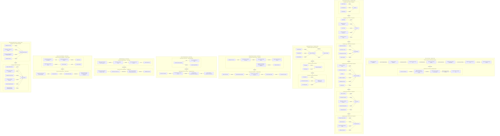

```mermaid
graph TB
%% Thesis 1: Diss Track Timeline (Temporal Frame)
subgraph T1["Diss Track Timeline - Temporal Frame"]
    direction TB

    %% Assertion 1: Main Diss Track Release Timeline
    subgraph A1["Temporal Logic: Diss Track Release Sequence"]
        START["Drake-Kendrick Beef Escalation"]
        EUPH["Kendrick released 'Euphoria'"]
        LA616["Kendrick released '6:16 in LA'"]
        FAM["Drake released 'Family Matters'"]
        MEET["Kendrick released 'Meet The Grahams'"]
        NLU["Kendrick released 'Not Like Us'"]
        HP6["Drake released 'The Heart Part Six'"]

        START --> |before Thursday-Saturday| EUPH
        EUPH --> |on Friday May 3rd 2024| LA616
        LA616 --> |after Friday May 3rd| FAM
        FAM --> |less than an hour after| MEET
        MEET --> |in early hours of Sunday| NLU
        NLU --> |after Sunday| HP6
    end

    %% Assertion 2: Commercial Performance Timeline
    subgraph A2["Temporal Logic: 'Not Like Us' Streaming Records"]
        NLU2["'Not Like Us' Released"]
        DAY1["Broke record for most streams for hip-hop song in one day"]
        DAY2["Broke same record again on second day"]
        DEBUT["Likely to debut at number one"]

        NLU2 --> |on first day| DAY1
        DAY1 --> |on next day| DAY2
        DAY2 --> |within five days of stream tracking| DEBUT
    end

    A1 --> |concurrent with| A2
end

%% Thesis 2: Track Composition Structure (Constitutive Frame)
subgraph T2["Track Composition Structure - Constitutive Frame"]
    direction TB

    %% Assertion 3: Euphoria Structure
    subgraph A3["Constitutive Logic: 'Euphoria' Composition"]
        E["'Euphoria'"]
        E_L["Lyrical Content"]
        E_B["Beat Production"]
        E_D["Diss Elements"]

        E_L --> |is-part-of| E
        E_B --> |is-part-of| E
        E_D --> |is-part-of| E
    end

    %% Assertion 4: 6:16 in LA Structure
    subgraph A4["Constitutive Logic: '6:16 in LA' Composition"]
        SIX["'6:16 in LA'"]
        SIX_SB["Slow Build"]
        SIX_AK["References to DJ Akademiks"]
        SIX_MC["Mole Claims"]
        SIX_OVO["OVO Camp Insider Information"]
        SIX_SAL["Claims About Team on Salary"]

        SIX_SB --> |is-part-of| SIX
        SIX_AK --> |is-part-of| SIX
        SIX_MC --> |is-part-of| SIX
        SIX_OVO --> |is-part-of| SIX
        SIX_SAL --> |is-part-of| SIX
    end

    %% Assertion 5: Family Matters Structure
    subgraph A5["Constitutive Logic: 'Family Matters' Composition"]
        FM["'Family Matters'"]
        FM_BS["Multiple Beat Switches"]
        FM_FL["Best Flows in Years"]
        FM_VD["Van Destruction in Video"]
        FM_JAB["Jabs at Kendrick"]

        FM_BS --> |is-part-of| FM
        FM_FL --> |is-part-of| FM
        FM_VD --> |is-part-of| FM
        FM_JAB --> |is-part-of| FM
    end

    %% Assertion 6: Meet The Grahams Structure
    subgraph A6["Constitutive Logic: 'Meet The Grahams' Composition"]
        MTG["'Meet The Grahams'"]
        MTG_ADD["Addresses to Drake's Family"]
        MTG_ALC["The Alchemist Production"]
        MTG_EB["Evil Beat"]
        MTG_DAU["Address to Daughter"]
        MTG_MAN["Manipulation Claims"]
        MTG_DIE["Death Wishes"]

        MTG_ADD --> |is-part-of| MTG
        MTG_ALC --> |is-part-of| MTG
        MTG_EB --> |is-part-of| MTG
        MTG_DAU --> |is-part-of| MTG
        MTG_MAN --> |is-part-of| MTG
        MTG_DIE --> |is-part-of| MTG
    end

    %% Assertion 7: Not Like Us Structure
    subgraph A7["Constitutive Logic: 'Not Like Us' Composition"]
        NLU_T["'Not Like Us'"]
        NLU_WCB["West Coast Beat"]
        NLU_DJM["DJ Mustard Production"]
        NLU_TAG["Tagline Bars - Certified Pedophile"]
        NLU_HIT["Certified Hit Single Status"]
        NLU_REC["Streaming Records"]

        NLU_WCB --> |is-part-of| NLU_T
        NLU_DJM --> |is-part-of| NLU_T
        NLU_TAG --> |is-part-of| NLU_T
        NLU_HIT --> |is-part-of| NLU_T
        NLU_REC --> |is-part-of| NLU_T
    end

    %% Assertion 8: The Heart Part Six Structure
    subgraph A8["Constitutive Logic: 'The Heart Part Six' Composition"]
        HP6_T["'The Heart Part Six'"]
        HP6_DL["Damage Limitation Mode"]
        HP6_DEN["Denial Statements"]
        HP6_FC["False Claims About Mother I Sober"]
        HP6_WH["Whimper Response"]

        HP6_DL --> |is-part-of| HP6_T
        HP6_DEN --> |is-part-of| HP6_T
        HP6_FC --> |is-part-of| HP6_T
        HP6_WH --> |is-part-of| HP6_T
    end

    A3 --> |followed by| A4
    A4 --> |followed by| A5
    A5 --> |followed by| A6
    A6 --> |followed by| A7
    A7 --> |followed by| A8
end

%% Thesis 3: Organizational Structure (Constitutive Frame)
subgraph T3["Organizational Structure - Constitutive Frame"]
    direction TB

    %% Assertion 9: Drake's Team Structure
    subgraph A9["Constitutive Logic: Drake's OVO Camp"]
        OVO["Drake's OVO Camp"]
        OVO_TM["Team Members"]
        OVO_SAL_STAFF["People on Salary"]
        OVO_MOLE["Potential Mole"]
        OVO_FED["Fed Up Members"]

        OVO_TM --> |is-part-of| OVO
        OVO_SAL_STAFF --> |is-part-of| OVO
        OVO_MOLE --> |is-part-of| OVO
        OVO_FED --> |is-part-of| OVO
        OVO --> |depends-on| OVO_SAL_STAFF
    end

    %% Assertion 10: Production Structure
    subgraph A10["Constitutive Logic: Key Producers"]
        PROD["Production Elements"]
        DJM_PROD["DJ Mustard"]
        ALC_PROD["The Alchemist"]

        DJM_PROD --> |is-part-of| PROD
        ALC_PROD --> |is-part-of| PROD
    end

    %% Assertion 11: Observer Structure
    subgraph A11["Constitutive Logic: External Participants"]
        OBS["Observers and Commentators"]
        DJA["DJ Akademiks"]
        YTR["YouTube Music Reactors"]
        FAN["Fans Taking Sides"]

        DJA --> |is-part-of| OBS
        YTR --> |is-part-of| OBS
        FAN --> |is-part-of| OBS
    end

    A9 --> |supported by| A10
    A10 --> |observed by| A11
end

%% Thesis 4: Strategic Release Causation (Causal Frame)
subgraph T4["Strategic Release Causation - Causal Frame"]
    direction TB

    %% Assertion 12: Strategic Release Chain
    subgraph A12["Causal Logic: Release Timing → Lead Shifts"]
        K616["Kendrick's '6:16 in LA'"]
        OpenDoor["Opened door for Drake to strike back"]
        DFM["Drake released 'Family Matters'"]
        BriefLead["People thought Drake took the lead"]
        KMTG["Kendrick released 'Meet The Grahams' less than hour later"]
        LeadLost["Drake lost the lead"]

        K616 --> |caused| OpenDoor
        OpenDoor --> |enabled| DFM
        DFM --> |resulted in| BriefLead
        KMTG --> |resulted in| LeadLost
    end

    %% Assertion 13: Information Advantage Chain
    subgraph A13["Causal Logic: Insider Info → Strategic Timing"]
        MoleOVO["Mole in OVO camp"]
        InsiderInfo["Insider information feeding"]
        Prediction["Kendrick predicted Drake's responses"]
        Timing["Perfect strategic timing"]
        PerfectExec["Near-perfect execution"]

        MoleOVO --> |provides| InsiderInfo
        InsiderInfo --> |enables| Prediction
        Prediction --> |leads to| Timing
        Timing --> |results in| PerfectExec
    end

    A12 --> |enabled by| A13
end

%% Thesis 5: Victory Through Superiority (Causal Frame)
subgraph T5["Victory Through Superiority - Causal Frame"]
    direction TB

    %% Assertion 14: Lyrical Superiority Chain
    subgraph A14["Causal Logic: Lyrical Power → Musical Annihilation"]
        KLyrical["Kendrick's lyrical superiority"]
        Annihilate["Musical annihilation of Drake"]
        LyricalWin["Lyrically trumped Drake"]

        KLyrical --> |led to| Annihilate
        KLyrical --> |resulted in| LyricalWin
    end

    %% Assertion 15: Commercial Dominance Chain
    subgraph A15["Causal Logic: 'Not Like Us' Success → Commercial Victory"]
        NLUSuccess["'Not Like Us' released"]
        RecordBreak["Record-breaking streaming success"]
        TrumpCommerce["Trumped Drake's commercialism selling point"]
        CommercialWin["Even commercial dominance lost by Drake"]

        NLUSuccess --> |achieved| RecordBreak
        RecordBreak --> |resulted in| TrumpCommerce
        TrumpCommerce --> |proves| CommercialWin
    end

    A14 --> |combined with| A15
end

%% Thesis 6: Self-Inflicted Damage (Causal Frame)
subgraph T6["Self-Inflicted Damage - Causal Frame"]
    direction TB

    %% Assertion 16: Weak Response Chain
    subgraph A16["Causal Logic: Weak Response → Fate Sealed"]
        HP6Weak["Drake's weak 'The Heart Part Six' response"]
        DamageControl["Full damage limitation mode"]
        NoSubstance["Not really saying much of his own"]
        FateSealed["Sealed Drake's fate"]

        HP6Weak --> |resulted in| DamageControl
        DamageControl --> |revealed| NoSubstance
        NoSubstance --> |led to| FateSealed
    end

    %% Assertion 17: Credibility Destruction Chain
    subgraph A17["Causal Logic: False Interpretation → Credibility Lost"]
        FalseClaim["Drake's false interpretation of 'Mother I Sober'"]
        TerriblePoint["Terrible point to hone in on"]
        AbhorrentMistake["Made even more abhorrent by being completely false"]
        CredLost["Credibility destroyed"]

        FalseClaim --> |is| TerriblePoint
        TerriblePoint --> |made worse as| AbhorrentMistake
        AbhorrentMistake --> |resulted in| CredLost
    end

    A16 --> |compounded by| A17
end

%% Thesis 7: Intrinsic vs Forced Motivation (Causal Frame)
subgraph T7["Intrinsic vs Forced Motivation - Causal Frame"]
    direction TB

    %% Assertion 18: Motivation Difference Chain
    subgraph A18["Causal Logic: Desire vs Obligation → Victory vs Defeat"]
        KWanted["Kendrick dissing because he wanted to"]
        KPerfect["Kendrick played game near perfectly"]
        KVictory["Kendrick won"]
        DHadTo["Drake dissing because he had to"]
        DWiped["Drake got wiped"]
        DDefeat["Drake lost battle"]

        KWanted --> |led to| KPerfect
        KPerfect --> |resulted in| KVictory
        DHadTo --> |resulted in| DWiped
        DWiped --> |proved| DDefeat
    end

    %% Assertion 19: Victory Lap Effect Chain
    subgraph A19["Causal Logic: Upbeat Finale → Cultural Impact"]
        UpbeatFinale["Kendrick's final knockout blow being upbeat"]
        VictoryLap["Victory lap effect"]
        SummerAnthem["Summer anthem status"]
        BeachParties["Beach and pool parties with Drake's downfall soundtrack"]

        UpbeatFinale --> |created| VictoryLap
        VictoryLap --> |resulted in| SummerAnthem
        SummerAnthem --> |manifests as| BeachParties
    end

    A18 --> |culminates in| A19
end

%% Thesis 8: Cultural Impact Meta-Structure (Constitutive Frame)
subgraph T8["Cultural Impact Meta-Structure - Constitutive Frame"]
    direction TB

    %% Assertion 20: Rap Beef Overall Structure
    subgraph A20["Constitutive Logic: The Beef Composition"]
        BEEF["Drake-Kendrick Rap Beef"]
        BEEF_TRACKS["Multiple Diss Tracks"]
        BEEF_PART["Participants - Drake and Kendrick"]
        BEEF_OBS["Observers - DJ Akademiks, YouTubers, Fans"]
        BEEF_TIME["Weekend Timeline"]

        BEEF_TRACKS --> |is-part-of| BEEF
        BEEF_PART --> |is-part-of| BEEF
        BEEF_OBS --> |is-part-of| BEEF
        BEEF_TIME --> |is-part-of| BEEF
    end

    %% Assertion 21: Cultural Impact Structure
    subgraph A21["Constitutive Logic: Cultural Impact"]
        CULT["Cultural Impact"]
        CULT_SUMMER["Summer Anthem Status"]
        CULT_BEACH["Beach and Pool Party Soundtrack"]
        CULT_TIMING["Kendrick's Perfect Timing"]
        CULT_PRED["Prediction of Drake's Response"]
        CULT_DOWN["Drake's Downfall Narrative"]
        CULT_HIST["Most hate-filled and entertaining rap beef"]

        CULT_SUMMER --> |is-part-of| CULT
        CULT_BEACH --> |is-part-of| CULT
        CULT_TIMING --> |is-part-of| CULT
        CULT_PRED --> |is-part-of| CULT
        CULT_DOWN --> |is-part-of| CULT
        CULT_HIST --> |is-part-of| CULT
    end

    A20 --> |resulted in| A21
end
```
