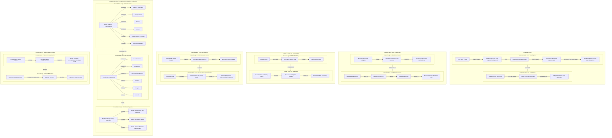

```mermaid
graph TB

%% Thesis 1: Temporal Frame - Programming Paradigm Evolution
subgraph T1["Temporal Frame"]
    direction TB

    %% Assertion 1: OOP Evolution
    subgraph A1["Temporal Logic - OOP Development"]
        direction LR
        OOP_Early["Early years of OOP"]
        OOP_Early --> |in early years| OOP_Optimal["Limited resources kept cognitive load optimal"]
        OOP_Optimal --> |then| OOP_Position["OOP positioned itself solidly"]
        OOP_Position --> |soon changed| OOP_Exponential["Computers developed exponentially"]
        OOP_Exponential --> |forwarding to current times| OOP_Current["Hundreds of classes with over-abstraction"]
    end

    %% Assertion 2: FP Rise
    subgraph A2["Temporal Logic - FP Emergence"]
        direction LR
        FP_Before["Traditional OOP dominance"]
        FP_Before --> |in the last years| FP_Emerge["React and Redux emerged"]
        FP_Emerge --> |subsequently| FP_Respect["FP gained respect from developers"]
    end

    A1 --> |preceded| A2
end

%% Thesis 2: Causal Frame - OOP Problems
subgraph T2["Causal Frame - OOP Challenges"]
direction TB

    %% Assertion 1: Inheritance Problem
    subgraph A3["Causal Logic - Inheritance Issues"]
        direction LR
        MI["Multiple inheritance ambiguity"]
        MI --> |causes| LS["Languages implement own solutions"]
        LS --> |results in| Stigma["Stigma on inheritance mechanisms"]
    end

    %% Assertion 2: Encapsulation Problem
    subgraph A4["Causal Logic - Encapsulation Issues"]
        direction LR
        Abuse["Abuse of encapsulation"]
        Abuse --> |leads to| Opaque["Opaque transparency"]
        Opaque --> |causes| Unpredictable["Unpredictable state"]
        Unpredictable --> |results in| Defensive["Developers write defensive code"]
    end

    A3 --> |contributes to| A4
end

%% Thesis 3: Causal Frame - FP Benefits
subgraph T3["Causal Frame - FP Advantages"]
    direction TB

    %% Assertion 1: Predictability
    subgraph A5["Causal Logic - FP Predictability"]
        direction LR
        PureFunctions["Pure functions"]
        PureFunctions --> |minimizes| MinState["Information held by code"]
        MinState --> |enables| Predictable["Predictable behavior"]
    end

    %% Assertion 2: Parallelization
    subgraph A6["Causal Logic - FP Scalability"]
        direction LR
        FPNature["Functional programming nature"]
        FPNature --> |enables| Threading["Natural scalability for threads"]
        Threading --> |results in| MaxData["Maximized data processing"]
    end

    A5 --> |complements| A6
end

%% Thesis 4: Causal Frame - OOP Strengths
subgraph T4["Causal Frame - OOP Advantages"]
    direction TB

    %% Assertion 1: Resource Management
    subgraph A7["Causal Logic - OOP Resource Control"]
        direction LR
        ObjectLife["Objects with natural lifecycle"]
        ObjectLife --> |enables| Monitor["Resource state monitoring"]
        Monitor --> |results in| MinResource["Minimized resource usage"]
    end

    %% Assertion 2: Communication
    subgraph A8["Causal Logic - OOP Architecture Communication"]
        direction LR
        ClassDiag["Class diagrams"]
        ClassDiag --> |facilitates| Vision["Communicating big-picture ideas"]
        Vision --> |results in| FastComm["Information domain understanding in seconds"]
    end

    A7 --> |supports| A8
end

%% Thesis 5: Constitutive Frame - Paradigm Components
subgraph T5["Constitutive Frame - Programming Paradigm Structures"]
    direction TB

    %% Assertion 1: OOP Components
    subgraph A9["Constitutive Logic - OOP Structure"]
        direction LR
        OOP["Object Oriented Programming"]
        OOP --> |consists of| ClassInherit["Classical Inheritance"]
        OOP --> |consists of| Encap["Encapsulation"]
        OOP --> |consists of| Classes["Classes"]
        OOP --> |consists of| Objects["Objects"]
        OOP --> |includes| GRASP["GRASP Design Principles"]
        OOP --> |includes| GoF["GoF Design Patterns"]
    end

    %% Assertion 2: FP Components
    subgraph A10["Constitutive Logic - FP Structure"]
        direction LR
        FP["Functional Programming"]
        FP --> |consists of| PureF["Pure Functions"]
        FP --> |consists of| Immut["Immutability"]
        FP --> |consists of| HOF["Higher Order Functions"]
        FP --> |includes| Functors["Functors"]
        FP --> |includes| Curry["Currying"]
        FP --> |includes| Monads["Monads"]
    end

    %% Assertion 3: Hybrid Approaches
    subgraph A11["Constitutive Logic - Symbiotic Systems"]
        direction LR
        Hybrid["Symbiotic Programming Approach"]
        Hybrid --> |includes| RxJS["RxJS - Observables with Functors"]
        Hybrid --> |includes| Luxon["Luxon - Immutable objects"]
        Hybrid --> |includes| MobX["MobX - Observable state management"]
    end

    A9 --> |combined with| A10
    A10 --> |forms| A11
end

%% Thesis 6: Causal Frame - Knowledge Transfer
subgraph T6["Causal Frame - Design Pattern Impact"]
    direction TB

    %% Assertion 1: Pattern Knowledge Effect
    subgraph A12["Causal Logic - Pattern Communication"]
        direction LR
        PatternKnow["Knowledge of design patterns"]
        PatternKnow --> |enables| HighLevel["High-level jargon communication"]
        HighLevel --> |results in| Dynamics["Entire dynamics communicated with single word"]
    end

    %% Assertion 2: Learning Impact
    subgraph A13["Causal Logic - Pattern Education"]
        direction LR
        TeachToolbox["Teaching complete toolbox"]
        TeachToolbox --> |requires less effort than| TeachZero["Teaching from zero"]
        TeachZero --> |benefits| Newcomers["Newcomer programmers"]
    end

    A12 --> |supports| A13
end
```
