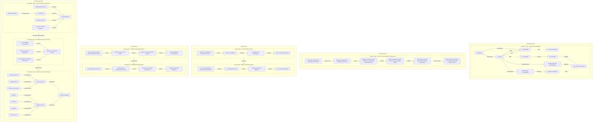

```mermaid
graph TB

%% Thesis 1: Deductive Frame - Hypothesis Classification
subgraph T1["Deductive Frame"]
    direction TB

    %% Assertion 1: Hypothesis Classification Logic
    subgraph A1["Deductive Logic - Hypothesis Classification"]
        H["Hypothesis"]
        T["Testable"]
        C["Contradictable"]
        SH["Scientific Hypothesis"]
        NSH["Non-scientific Hypothesis"]

        H --> |has property| T
        H --> |has property| C
        T --> |AND| C
        C --> |AND| T
        T -.-> |NOT| NT["Not Testable"]
        C -.-> |NOT| NC["Not Contradictable"]

        T --> |if TRUE with C| COND1["Testable AND Contradictable"]
        NT --> |if TRUE| COND2["NOT Testable"]
        T --> |if TRUE with NC| COND3["Testable AND NOT Contradictable"]

        COND1 --> |IMPLIES| SH
        COND2 --> |IMPLIES| NSH
        COND3 --> |IMPLIES| NSH

        SH -.-> |XOR| NSH
    end
end

%% Thesis 2: Temporal Frame - Historical Development
subgraph T2["Temporal Frame"]
    direction TB

    %% Assertion 1: History of Naturalization
    subgraph A2["Temporal Logic - History of Naturalization of Explanations"]
        AE["Ancient Era: Supernatural Explanations Dominant"]
        LR["Lightning considered tool of Gods to punish evil"]

        AE --> |before 1752| LR
        LR --> |in 1752| FR["Benjamin Franklin invented lightning rod challenging supernatural view"]
        FR --> |in 1859| DT["Darwin published evolution theory replacing intelligent design"]
        DT --> |in 1860s| GT["Germ theory replaced supernatural disease explanations"]
        GT --> |in 20th century| MC["Modern science contradicts young Earth astrology prayer efficacy"]
    end
end

%% Thesis 3: Causal Frame - Probability and Scientific Practice
subgraph T3["Causal Frame"]
    direction TB

    %% Assertion 1: Low Prior Probability Chain
    subgraph A3["Causal Logic - Historical Pattern Effects"]
        HCC["History of Contradicted Supernatural Claims"]
        LPP["Low Prior Probability"]
        SAI["Scientists Avoid Investigation"]
        RRL["Rare in Research Literature"]

        HCC --> |causes| LPP
        LPP --> |results in| SAI
        SAI --> |leads to| RRL
    end

    %% Assertion 2: Resource Allocation
    subgraph A4["Causal Logic - Resource Allocation Effects"]
        LPP2["Low Prior Probability of Supernatural Explanations"]
        LRP["Low Research Priority"]
        RR["Reduced Resources Allocated"]
        DI["Decreased Investigation"]

        LPP2 --> |results in| LRP
        LRP --> |causes| RR
        RR --> |leads to| DI
    end

    A3 --> |reinforces| A4
end

%% Thesis 4: Causal Frame - Educational Interventions
subgraph T4["Causal Frame"]
    direction TB

    %% Assertion 1: Critical Thinking Development
    subgraph A5["Causal Logic - Critical Thinking Development"]
        TCT["Teaching Critical Thinking About Supernatural Claims"]
        STB["Students Learn to Test Beliefs"]
        BC["Beliefs Get Contradicted by Evidence"]
        RBP["Reduced Belief in Pseudoscience"]

        TCT --> |causes| STB
        STB --> |results in| BC
        BC --> |leads to| RBP
    end

    %% Assertion 2: Historical Education
    subgraph A6["Causal Logic - Historical Education Effects"]
        LHS["Learning History of Science"]
        UNP["Understanding Naturalization Process"]
        PNE["Preference for Natural Explanations"]
        IN["Internalized Scientific Naturalism"]

        LHS --> |results in| UNP
        UNP --> |causes| PNE
        PNE --> |leads to| IN
    end

    A5 --> |complements| A6
end

%% Thesis 5: Constitutive Frame - Scientific Methodology Structure
subgraph T5["Constitutive Frame"]
    direction TB

    %% Assertion 1: Components of Scientific Method
    subgraph A7["Constitutive Logic - Scientific Method Components"]
        SM["Scientific Method"]
        HG["Hypothesis Generation"]
        TD["Test Design"]
        EP["Explicit Predictions"]
        ET["Empirical Testing"]
        EV["Evaluation Against Evidence"]

        HG --> |is part of| SM
        TD --> |is part of| SM
        ET --> |is part of| SM
        EV --> |is part of| SM
        EP --> |is component of| TD
    end

    %% Assertion 2: Bayesian Confirmation Theory
    subgraph A8["Constitutive Logic - Bayesian Evaluation Structure"]
        BCT["Bayesian Confirmation Theory"]
        PPA["Prior Probability Assessment"]
        EEE["Empirical Evidence Evaluation"]
        CPA["Consideration of Plausible Alternatives"]

        PPA --> |is part of| BCT
        EEE --> |is part of| BCT
        CPA --> |is part of| BCT
    end

    %% Assertion 3: Knowledge Domains
    subgraph A9["Constitutive Logic - Domains of Human Knowledge"]
        HK["Human Knowledge"]
        SCI["Science Domain"]
        REL["Religion Domain"]
        EME["Empirical Evidence"]
        TEC["Testable Claims"]
        TCON["Tentative Conclusions"]
        TRAD["Tradition"]
        AUTH["Authority"]
        REV["Revelation"]
        ETR["Eternal Truths"]

        SCI --> |is domain of| HK
        REL --> |is domain of| HK

        EME --> |is component of| SCI
        TEC --> |is component of| SCI
        TCON --> |is component of| SCI

        TRAD --> |is component of| REL
        AUTH --> |is component of| REL
        REV --> |is component of| REL
        ETR --> |is component of| REL
    end

    A7 --> |provides methodology for| A8
    A8 --> |applies within| A9
end
```
