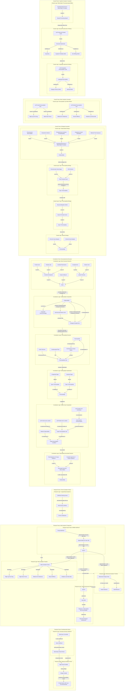

```mermaid
graph LR

%% Thesis 1: Developmental History Temporal Frame
subgraph T1["Temporal Frame: Developmental History"]
    direction TB

    subgraph A1["Temporal Logic: Perinatal and Early Childhood"]
        direction TB
        Birth["Birth Event: Twin Birth"]
        EarlyChildhood["Early Childhood"]
        ElementarySchool["Elementary School Period"]

        Birth -->|in early childhood| EarlyChildhood
        EarlyChildhood -->|during elementary school| ElementarySchool
    end

    subgraph A2["Temporal Logic: Adolescent Athletic Period"]
        direction TB
        HighSchool["High School Football"]
        CollegeFootball["College Football"]
        HeadInjuries["5 Head Injuries with Loss of Consciousness"]

        ElementarySchool -->|during high school| HighSchool
        HighSchool -->|during college| CollegeFootball
        CollegeFootball -->|sustained during athletic career| HeadInjuries
    end

    A1 -->|progressed to| A2
end

%% Thesis 2: Adult Symptom Progression Temporal Frame
subgraph T2["Temporal Frame: Adult Symptom Progression"]
    direction TB

    subgraph A3["Temporal Logic: Early to Middle Adulthood"]
        direction TB
        YoungAdulthood["Young Adulthood"]
        Age30["Approximately 30 Years Old"]
        Age51["Age 51"]

        YoungAdulthood -->|approximately 30 years after birth| Age30
        Age30 -->|approximately 21 years later| Age51
    end

    subgraph A4["Temporal Logic: Motor Symptom Timeline"]
        direction TB
        MotorOnset["Motor Symptom Onset"]
        RightLegDrag["Right Leg Foot Drag"]
        RightHandTremor["Right Hand Tremor"]
        ArmWeakness["Bilateral Arm Weakness"]
        MuscleStiffness["Muscle Stiffness"]
        Imbalance["Imbalance and Near-falls"]

        Age51 -->|approximately 3 years before diagnosis| MotorOnset
        MotorOnset -->|developed| RightLegDrag
        MotorOnset -->|developed| RightHandTremor
        MotorOnset -->|developed| ArmWeakness
        MotorOnset -->|developed| MuscleStiffness
        MotorOnset -->|developed| Imbalance
    end

    subgraph A5["Temporal Logic: Behavioral Symptom Timeline"]
        direction TB
        BehaviorOnset["Behavioral Change Onset"]
        VerbalOutbursts["Verbal Outbursts"]
        OddBehaviors["Odd Behaviors"]

        Age51 -->|approximately 1 year before diagnosis| BehaviorOnset
        BehaviorOnset -->|1-2 times per month| VerbalOutbursts
        BehaviorOnset -->|manifested as| OddBehaviors
    end

    subgraph A6["Temporal Logic: Clinical Assessment Period"]
        direction TB
        Age54["Age 54"]
        BrainMRI["Brain MRI"]
        Diagnosis["Diagnosis: Colpocephaly and Porencephaly"]
        NeuropsychAssessment["Neuropsychological Assessment"]

        Age51 -->|3 years of symptom progression| Age54
        Age54 -->|underwent| BrainMRI
        BrainMRI -->|revealed| Diagnosis
        Diagnosis -->|followed by| NeuropsychAssessment
    end

    A3 -->|led to| A4
    A4 -->|concurrent with| A5
    A5 -->|prompted| A6
end

%% Thesis 3: Chronic Symptom History Temporal Frame
subgraph T3["Temporal Frame: Chronic Symptom History"]
    direction TB

    subgraph A7["Temporal Logic: Longstanding Symptoms"]
        direction TB
        ChildhoodHearing["Childhood Hearing Issues"]
        AdulthoodSensory["Adult Sensory Deficits"]
        ChronicHeadaches["Chronic Headaches"]

        ChildhoodHearing -->|persisted throughout life as| AdulthoodSensory
        AdulthoodSensory -->|accompanied by| ChronicHeadaches
    end
end

%% Thesis 4: Constitutive Frame - Neuroanatomical Structure
subgraph T4["Constitutive Frame: Neuroanatomical Structure"]
    direction TB

    subgraph A8["Constitutive Logic: Brain Structural Hierarchy"]
        direction TB
        Brain["Brain"]
        CerebralHemisphere["Cerebral Hemisphere"]
        FrontalLobe["Frontal Lobe"]
        ParietalLobe["Parietal Lobe"]
        CerebralParenchyma["Cerebral Parenchyma"]
        CorpusCallosum["Corpus Callosum"]
        LateralVentricles["Lateral Ventricles"]
        OccipitalHorn["Occipital Horn"]
        AnteriorHorn["Anterior Horn"]

        FrontalLobe -->|is part of| CerebralHemisphere
        ParietalLobe -->|is part of| CerebralHemisphere
        CerebralParenchyma -->|is part of| CerebralHemisphere
        CerebralHemisphere -->|is part of| Brain
        CorpusCallosum -->|is part of| Brain
        LateralVentricles -->|is part of| Brain
        OccipitalHorn -->|is part of| LateralVentricles
        AnteriorHorn -->|is part of| LateralVentricles
    end

    subgraph A9["Constitutive Logic: Colpocephaly Composition"]
        direction TB
        Colpocephaly["Colpocephaly"]
        CongenitalVentriculomegaly["Congenital Ventriculomegaly"]
        EnlargedOccipitalHorn["Enlarged Occipital Horn"]
        NormalAnteriorHorn["Normal-sized Anterior Horn"]

        Colpocephaly -->|is a form of| CongenitalVentriculomegaly
        EnlargedOccipitalHorn -->|is characteristic of| Colpocephaly
        NormalAnteriorHorn -->|contrasts with| EnlargedOccipitalHorn
        Colpocephaly -->|consists of disproportionate enlargement between| EnlargedOccipitalHorn
        Colpocephaly -->|consists of disproportionate enlargement between| NormalAnteriorHorn
    end

    subgraph A10["Constitutive Logic: Porencephaly Structure"]
        direction TB
        Porencephaly["Porencephaly"]
        PorencephalicCyst["Porencephalic Cyst"]
        CerebrospinalFluid["Cerebrospinal Fluid"]
        CorticalDefect["Full-thickness Cortical Defect"]
        CysticStructure["Cystic Structure"]

        Porencephaly -->|is characterized by| CorticalDefect
        PorencephalicCyst -->|is manifestation of| Porencephaly
        CysticStructure -->|is structural form of| PorencephalicCyst
        CerebrospinalFluid -->|fills| PorencephalicCyst
        CorticalDefect -->|contains| PorencephalicCyst
    end

    subgraph A11["Constitutive Logic: Porencephaly Classification"]
        direction TB
        PorencephalyTypes["Porencephaly"]
        TypeI["Type I Porencephaly"]
        TypeII["Type II Porencephaly"]
        CongenitalOrigin["Congenital Origin"]
        AcquiredOrigin["Acquired Origin"]

        TypeI -->|is subtype of| PorencephalyTypes
        TypeII -->|is subtype of| PorencephalyTypes
        CongenitalOrigin -->|defines| TypeI
        AcquiredOrigin -->|defines| TypeII
    end

    subgraph A12["Constitutive Logic: Patient Case Composition"]
        direction TB
        PatientCondition["Patient Neurological Condition"]
        MarkedColpocephaly["Marked Colpocephaly"]
        LargePorencephalicCyst["Large Porencephalic Cyst"]
        LeftFrontalLocation["Left Frontal Lobe Location"]
        LeftParietalLocation["Left Parietal Lobe Location"]
        CystVentricleConnection["Cyst-Ventricle Communication"]
        LeftOccipitalHornConnection["Left Occipital Horn Connection"]

        MarkedColpocephaly -->|is component of| PatientCondition
        LargePorencephalicCyst -->|is component of| PatientCondition
        LeftFrontalLocation -->|is anatomical location of| LargePorencephalicCyst
        LeftParietalLocation -->|is anatomical location of| LargePorencephalicCyst
        CystVentricleConnection -->|is structural feature of| LargePorencephalicCyst
        LeftOccipitalHornConnection -->|is connected to| CystVentricleConnection
    end

    subgraph A13["Constitutive Logic: Colpocephaly Associated Features"]
        direction TB
        ColpocephalyCondition["Colpocephaly"]
        AssociatedFeatures["Associated Structural Abnormalities"]
        PartialAgenesis["Partial Agenesis of Corpus Callosum"]
        CompleteAgenesis["Complete Agenesis of Corpus Callosum"]

        AssociatedFeatures -->|is often associated with| ColpocephalyCondition
        PartialAgenesis -->|is type of| AssociatedFeatures
        CompleteAgenesis -->|is type of| AssociatedFeatures
    end

    A8 -->|provides anatomical foundation for| A9
    A9 -->|describes ventricular pathology distinct from| A10
    A10 -->|includes classification| A11
    A11 -->|is applied in| A12
    A12 -->|may include| A13
end

%% Thesis 5: Etiological Causation Frame
subgraph T5["Causal Frame: Etiological Causation"]
    direction TB

    subgraph A14["Causal Logic: Colpocephaly Etiology"]
        direction TB
        ChromosomalAbnormalities["Chromosomal Abnormalities"]
        IntrauterineInfection["Intrauterine Infection"]
        PerinatalAnoxia["Perinatal Anoxic-Ischemic Encephalopathy"]
        GrowthRetardation["Intrauterine Growth Retardation"]
        ToxinExposure["Maternal Toxin Exposure"]
        WhiteMatterArrest["Developmental Arrest of White Matter Formation"]
        ColpocephalyDevelopment["Colpocephaly"]

        ChromosomalAbnormalities -->|causes| WhiteMatterArrest
        IntrauterineInfection -->|causes| WhiteMatterArrest
        PerinatalAnoxia -->|causes| WhiteMatterArrest
        GrowthRetardation -->|causes| WhiteMatterArrest
        ToxinExposure -->|causes| WhiteMatterArrest
        WhiteMatterArrest -->|results in| ColpocephalyDevelopment
    end

    subgraph A15["Causal Logic: Type I Porencephaly Etiology"]
        direction TB
        PeriventricularHemorrhage["Periventricular Hemorrhage"]
        CNSInfection["CNS Infection"]
        ThirdTrimester["Third Trimester Event"]
        TypeIPorencephaly["Type I Porencephaly"]

        PeriventricularHemorrhage -->|occurs in| ThirdTrimester
        CNSInfection -->|occurs in| ThirdTrimester
        ThirdTrimester -->|causes destructive process resulting in| TypeIPorencephaly
    end

    subgraph A16["Causal Logic: Type II Porencephaly Etiology"]
        direction TB
        NeuronalMigrationDefect["Neuronal Migration Defect"]
        SecondTrimester["Second Trimester Event"]
        TypeIIPorencephaly["Type II Porencephaly"]

        NeuronalMigrationDefect -->|occurs in| SecondTrimester
        SecondTrimester -->|results in| TypeIIPorencephaly
    end

    subgraph A17["Causal Logic: Genetic Etiology"]
        direction TB
        COL4A1Mutation["COL4A1 Gene Mutation"]
        COL4A2Mutation["COL4A2 Gene Mutation"]
        GeneticPorencephaly["Porencephaly"]

        COL4A1Mutation -->|causes| GeneticPorencephaly
        COL4A2Mutation -->|causes| GeneticPorencephaly
    end

    A14 -->|distinct etiology from| A15
    A15 -->|contrasts with| A16
    A16 -->|may involve| A17
end

%% Thesis 6: Neuroanatomical-Motor Symptom Causation Frame
subgraph T6["Causal Frame: Motor Symptom Causation"]
    direction TB

    subgraph A18["Causal Logic: Porencephalic Cyst Motor Effects"]
        direction TB
        LeftFrontalCyst["Left Frontal Porencephalic Cyst"]
        LeftParietalCyst["Left Parietal Porencephalic Cyst"]
        RightLegFootDrag["Right Leg Foot Drag"]
        RightHandTremorSymptom["Right Hand Tremor"]
        BilateralArmWeakness["Bilateral Arm Weakness"]
        MuscleStiffnessSymptom["Muscle Stiffness"]
        ImbalanceSymptom["Imbalance and Near-falls"]

        LeftFrontalCyst -->|causes contralateral| RightLegFootDrag
        LeftFrontalCyst -->|causes contralateral| RightHandTremorSymptom
        LeftParietalCyst -->|contributes to| BilateralArmWeakness
        LeftParietalCyst -->|contributes to| MuscleStiffnessSymptom
        LeftParietalCyst -->|contributes to| ImbalanceSymptom
    end
end

%% Thesis 7: Neuroanatomical-Cognitive Symptom Causation Frame
subgraph T7["Causal Frame: Cognitive Symptom Causation"]
    direction TB

    subgraph A19["Causal Logic: White Matter Processing Speed Effect"]
        direction TB
        WhiteMatterArrestCognitive["Developmental Arrest of White Matter Formation"]
        SlowedProcessingSpeed["Slowed Processing Speed"]

        WhiteMatterArrestCognitive -->|results in| SlowedProcessingSpeed
    end

    subgraph A20["Causal Logic: Executive Dysfunction Pathway"]
        direction TB
        LeftFrontalParietalCysts["Left Frontal and Parietal Cysts"]
        ExecutiveDysfunction["Executive Dysfunction"]
        Impulsivity["Impulsivity"]
        CognitiveFlexibilityDeficit["Cognitive Flexibility Deficit"]
        SetShiftingDeficit["Set-Shifting Deficit"]

        LeftFrontalParietalCysts -->|causes| ExecutiveDysfunction
        ExecutiveDysfunction -->|manifests as| Impulsivity
        ExecutiveDysfunction -->|manifests as| CognitiveFlexibilityDeficit
        ExecutiveDysfunction -->|manifests as| SetShiftingDeficit
    end

    subgraph A21["Causal Logic: Language Impairment Pathway"]
        direction TB
        LeftHemisphereCysts["Left Hemisphere Porencephalic Cysts"]
        LanguageAbnormalities["Language Abnormalities"]
        CategoryFluencyDeficit["Category Fluency Deficit"]
        NamingDeficit["Naming Deficit"]

        LeftHemisphereCysts -->|causes| LanguageAbnormalities
        LanguageAbnormalities -->|manifests as| CategoryFluencyDeficit
        LanguageAbnormalities -->|manifests as| NamingDeficit
    end

    A19 -->|independent effect from| A20
    A20 -->|distinct from| A21
end
```
