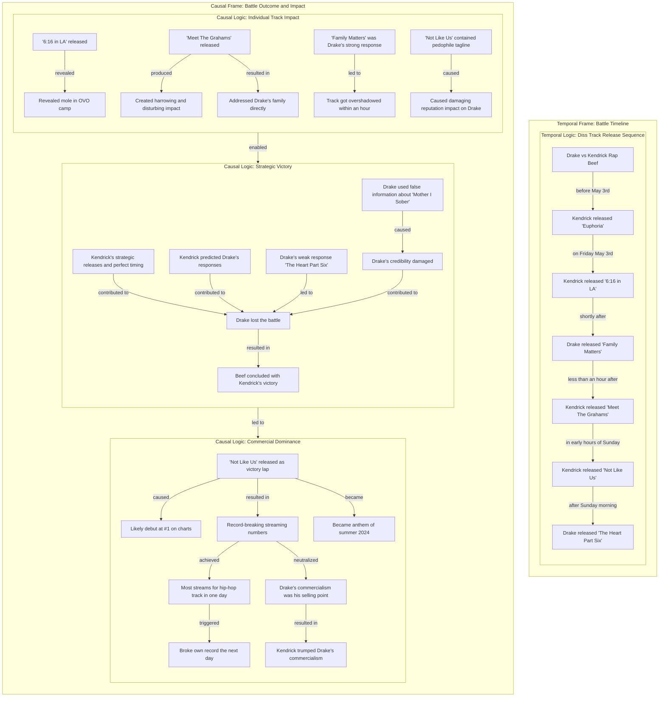

```mermaid
graph TB
%% Thesis 1: Temporal Frame - Drake vs Kendrick Battle Timeline
subgraph T1["Temporal Frame: Battle Timeline"]
    direction TB

    %% Assertion 1: Timeline of Diss Tracks
    subgraph A1["Temporal Logic: Diss Track Release Sequence"]
        direction TB
        H["Drake vs Kendrick Rap Beef"]
        H --> |before May 3rd| E["Kendrick released 'Euphoria'"]
        E --> |on Friday May 3rd| K1["Kendrick released '6:16 in LA'"]
        K1 --> |shortly after| D1["Drake released 'Family Matters'"]
        D1 --> |less than an hour after| K2["Kendrick released 'Meet The Grahams'"]
        K2 --> |in early hours of Sunday| K3["Kendrick released 'Not Like Us'"]
        K3 --> |after Sunday morning| D2["Drake released 'The Heart Part Six'"]
    end
end

%% Thesis 2: Causal Frame - Battle Outcome and Impact
subgraph T2["Causal Frame: Battle Outcome and Impact"]
    direction TB

    %% Assertion 1: Individual Track Impact
    subgraph A2["Causal Logic: Individual Track Impact"]
        direction TB
        T1_["'6:16 in LA' released"]
        M1["Revealed mole in OVO camp"]
        T2_["'Meet The Grahams' released"]
        H1["Created harrowing and disturbing impact"]
        F1["Addressed Drake's family directly"]
        T3["'Family Matters' was Drake's strong response"]
        O1["Track got overshadowed within an hour"]
        T4["'Not Like Us' contained pedophile tagline"]
        R1["Caused damaging reputation impact on Drake"]

        T1_ --> |revealed| M1
        T2_ --> |produced| H1
        T2_ --> |resulted in| F1
        T3 --> |led to| O1
        T4 --> |caused| R1
    end

    %% Assertion 2: Strategic Victory
    subgraph A3["Causal Logic: Strategic Victory"]
        direction TB
        KS["Kendrick's strategic releases and perfect timing"]
        KP["Kendrick predicted Drake's responses"]
        DW["Drake's weak response 'The Heart Part Six'"]
        FI["Drake used false information about 'Mother I Sober'"]
        CD["Drake's credibility damaged"]
        DL["Drake lost the battle"]
        BC["Beef concluded with Kendrick's victory"]

        KS --> |contributed to| DL
        KP --> |contributed to| DL
        DW --> |led to| DL
        FI --> |caused| CD
        CD --> |contributed to| DL
        DL --> |resulted in| BC
    end

    %% Assertion 3: Commercial Impact
    subgraph A4["Causal Logic: Commercial Dominance"]
        direction TB
        NLU["'Not Like Us' released as victory lap"]
        D1_["Likely debut at #1 on charts"]
        S1["Record-breaking streaming numbers"]
        S2["Most streams for hip-hop track in one day"]
        S3["Broke own record the next day"]
        CA["Drake's commercialism was his selling point"]
        CT["Kendrick trumped Drake's commercialism"]
        SU["Became anthem of summer 2024"]

        NLU --> |caused| D1_
        NLU --> |resulted in| S1
        S1 --> |achieved| S2
        S2 --> |triggered| S3
        S1 --> |neutralized| CA
        CA --> |resulted in| CT
        NLU --> |became| SU
    end

    A2 --> |enabled| A3
    A3 --> |led to| A4
end
```
